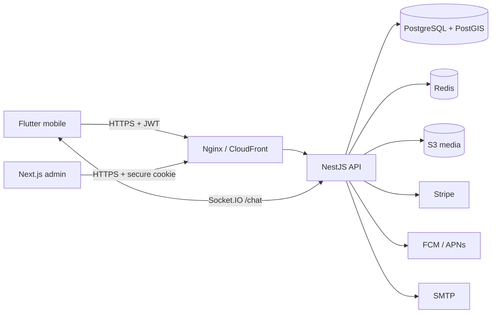

# TouchMe Architecture

TouchMe is a Zalo-style nearby social platform: discover people by location, add friends, and message anyone without a match.



## Core flows

1. **Nearby** — PostGIS distance query with gender, age, and radius filters.
2. **Friends** — Friend requests with accept/reject; bidirectional friendship rows.
3. **Messages** — Direct 1:1 conversations; open messaging (no friend required).
4. **Safety** — Block and report enforced in discovery, friends, and messaging.

## API modules

| Module | Purpose |
|--------|---------|
| `auth` | Email, phone OTP, social login, JWT refresh |
| `profiles` | Profile, photos, interests, location |
| `discovery` | Nearby people list with filters |
| `friends` | Friend requests and friendships |
| `messages` | Conversations, chat history, WebSocket gateway |
| `safety` | Block, report, moderation queue |
| `uploads` | Presigned and direct photo upload |
| `subscriptions` | TouchMe Plus (Stripe) |
| `admin` | Users, reports, analytics, plans |

## Security

- Global JWT guard on API routes; role guard for admin.
- Refresh tokens rotated and stored hashed (Argon2).
- Block checks on discovery, friend requests, and messaging.
- Rate limits via Redis throttler and message spam guard.

## Repository layout

```text
apps/api       NestJS REST + WebSocket
apps/admin     Next.js moderation console
apps/mobile    Flutter (iOS, Android, Web)
infra          Docker, LocalStack, Terraform
docs           Architecture, ERD, security, deployment
```
