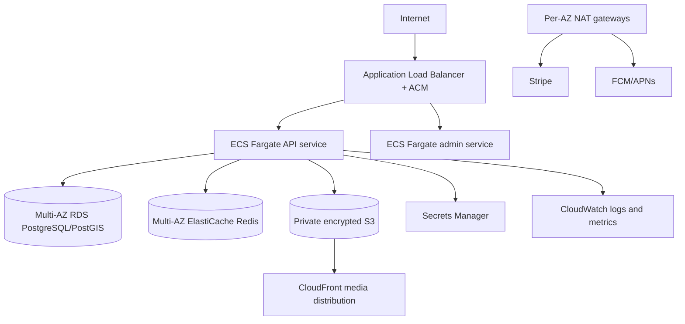

# AWS architecture

The ALB, NAT gateways, and ECS tasks span two availability zones. Only the ALB is internet-facing. ECS, RDS, and ElastiCache use private subnets and least-privilege security groups. RDS has encryption, Multi-AZ failover, deletion protection, performance insights, and 14-day backups. Redis uses TLS, an auth token, encryption at rest, failover, and snapshots. S3 blocks public access; CloudFront accesses objects with origin access control.

