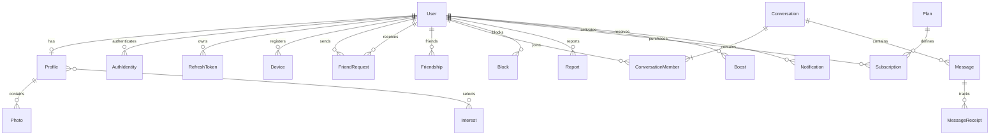

# Entity relationship diagram

```mermaid
erDiagram
  User ||--o| Profile : has
  User ||--o{ AuthIdentity : authenticates
  User ||--o{ RefreshToken : owns
  User ||--o{ Device : registers
  Profile ||--o{ Photo : contains
  Profile }o--o{ Interest : selects
  User ||--o{ FriendRequest : sends
  User ||--o{ FriendRequest : receives
  User ||--o{ Friendship : friends
  Conversation ||--|{ ConversationMember : contains
  User ||--o{ ConversationMember : joins
  Conversation ||--o{ Message : contains
  Message ||--o{ MessageReceipt : tracks
  User ||--o{ Block : blocks
  User ||--o{ Report : reports
  User ||--o{ Subscription : purchases
  User ||--o{ Boost : activates
  User ||--o{ Notification : receives
  Plan ||--o{ Subscription : defines
```

Geospatial nearby discovery uses `Profile.latitude` and `Profile.longitude` with PostGIS `ST_DWithin` / `ST_Distance` in raw SQL.
